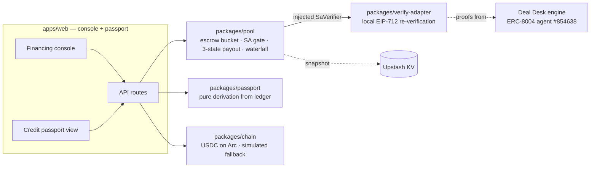

# EscrowFi

**SME trade finance on Arc, where the credit gate is a verifiable compliance
proof — not trust. Every completed cycle becomes a line in an on-ledger,
re-verifiable Credit Passport.**

A UAE SME exports goods and needs working capital *now*; its buyer pays at
maturity. EscrowFi closes that gap with three moves:

1. **Escrow** — the importer locks the invoice amount in the pool (USDC),
   earmarked for that one trade. Conditional protection for the buyer,
   certainty of funds for everyone else.
2. **SA-gated advance** — the [Deal Desk](https://github.com/web3yaso/citely-deal-desk)
   engine produces a Settlement Authorization (SA): a signed, hash-anchored
   compliance proof. The pool re-verifies it **locally** (EIP-712 signature ↔
   registered signer, expiry, and a PASS leg naming this payee and amount) and
   advances the exporter T+0. No valid proof, no money — the gate is on the
   money path and no frontend parameter can bypass it.
3. **Waterfall release** — at delivery/maturity the escrow splits atomically:
   principal + fee back to LPs, the residual to the exporter. Every transfer
   carries a tx hash; every advance carries its SA hash.

The by-product is the product: an ERC-8004-anchored **Credit Passport** —
never stored, derived from the pool ledger on every read, each line
re-verifiable by anyone (re-run the SA check live, click through to the
explorer). Compliance-as-collateral instead of credit committees.

**Live demo:** https://escrowfi-web.vercel.app — Arc testnet, real USDC, KV-persisted.

> Track 2 — Best SME Trade Finance & Working Capital Workflow
> (Ignyte Stablecoins Commerce Stack Challenge). Settlement engine powered by
> Deal Desk, our Encode Arc Hackathon project; this repo is the trade-finance
> application built on top of it.

## Why this is different

Huma/Arf-style PayFi advances against receivables, but their underwriting is
institutional due diligence. Here the underwriting artifact is **machine-
verifiable per transaction**: registry → SA signature → escrow coverage →
advance. The failed trade-finance consortia (TradeLens, we.trade, Marco Polo)
required the whole supply chain to change workflows; this design only has to
convince one party — the liquidity provider — and the proof does that job.

## Architecture



- **`packages/pool`** — the accounting core. Formally modeled in Quint
  (`packages/pool/specs/`): 7 fund-safety invariants (conservation, escrow
  isolation, gate completeness, settlement consistency…) hold across sampled
  model checking, and a seeded fuzz harness asserts the same invariants in
  vitest after every random operation. The model is ground truth; the
  implementation mirrors it invariant-for-invariant.
- **`packages/verify-adapter`** — the pool's trust boundary. Verifies SAs
  locally with the vendored Deal Desk verifier checks: your own money, your
  own verification — no reliance on the issuer's uptime or honesty.
- **`packages/chain`** — `CHAIN_MODE=arc` for real Arc-testnet USDC
  (fail-closed: reverted transfers throw, unknown modes throw, txs bound to
  chain id) or `simulated` (deterministic hashes, clearly labeled in the UI).
- **`packages/passport`** — zero state. A passport that is recomputed from
  verifiable records on every read cannot be forged or drift out of sync.

## Fund-safety invariants (each enforced in code, tested, and model-checked)

1. No advance ever leaves the pool without a locally verified SA **bound to
   that payee and amount**; escrowed advances additionally require full
   escrow coverage (`P + fee ≤ F`) and one active advance per invoice.
2. Advances are idempotent by `advanceId`; tampered replays are hard-rejected.
3. Fees are fixed at advance time and never round to zero.
4. Escrow funds are strictly isolated from LP liquidity — they can only leave
   through the release waterfall, exactly once per invoice.
5. Money leaves accounting only with an on-chain confirmation
   (`PENDING_PAYOUT → confirm/cancel`); a cancelled payout rolls back fully.
6. Repayment is exact-amount-or-error; the waterfall three-way split always
   sums to the escrow amount.
7. All amounts are bigint USDC minor units. No floats on the money path.

## Run it

```bash
pnpm install
pnpm -r test        # 53 tests: pool (33) · chain (4) · verify-adapter (8) · passport (3) · web (5)
pnpm typecheck
cd apps/web && pnpm dev   # console on http://localhost:3000, simulated chain
```

Formal model: `cd packages/pool/specs && quint test pool_test.qnt --main=pool_test`
(see `packages/pool/specs/README.md` for the full invariant/witness commands).

Env (`apps/web`): `CHAIN_MODE=arc` needs `ARC_RPC_URL`, `POOL_WALLET_KEY`,
`ARC_USDC_ADDRESS`, `ARC_CHAIN_ID`; KV persistence needs `KV_URL`, `KV_TOKEN`.
Defaults: simulated chain + in-memory store — the full demo runs with zero
configuration.

## Circle products

| Product | Use here |
|---|---|
| **USDC (Arc)** | Escrow, advances, waterfall settlement — every money movement |
| **Circle Wallets** | Roadmap: embedded wallets so non-crypto SMEs hold their own keys |
| **CCTP + Bridge Kit** | Roadmap: exporter chooses the receiving chain for advances |
| **Gateway** | Roadmap: treasury routing for multi-pool operations |
| **USYC** | Roadmap: yield on idle pool liquidity between advances |

### Product feedback

- *USDC/Arc*: the EVM-standard surface made the chain adapter trivially thin
  (viem + erc20Abi); public testnet RPC rate limits were the only friction —
  a documented, keyed dev endpoint would remove it.
- *Wallets/CCTP*: architecture-level in this release; the docs are clear, but
  a single "testnet quickstart matrix" (which chains, which faucets, which
  quotas) would make evaluation much faster.

## Honest limitations & roadmap

- **Custody**: pool funds sit in a developer-controlled wallet for the MVP;
  production path is an ERC-4626 vault.
- **Dispute window**: releases are importer-confirmed or maturity-triggered;
  a dispute/arbitration path (reusing Deal Desk's ESCALATE semantics) is
  designed but not built.
- **Escrow refund** (deal cancelled before any advance) — surfaced by the
  Quint model as a gap; roadmap.
- Verifier module-attestation and rubric-coverage checks (beyond signature/
  expiry/leg binding) activate once the Deal Desk manifest assets ship with
  the app.
- Demo SAs are minted at boot through Deal Desk's own signing code path
  (vendored, real EIP-712 signatures — including a deliberately rogue-signed
  one to demo rejection); wiring to the live Deal Desk issuance API is the
  next integration step.
