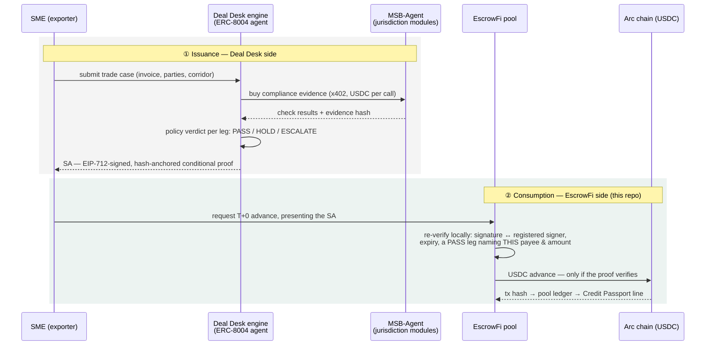
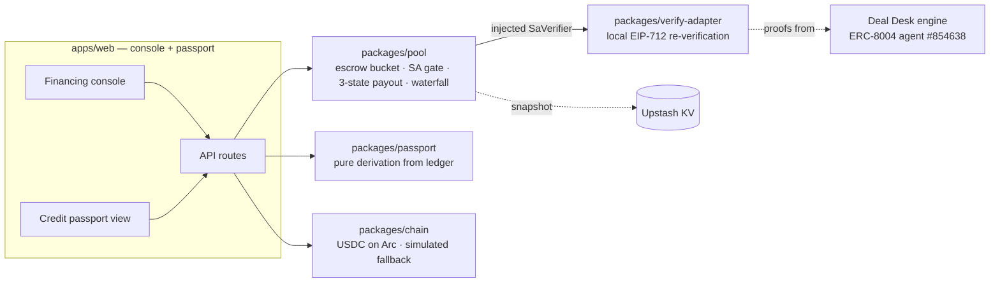

<div align="center">

# EscrowFi

**SME trade finance on Arc, where the credit gate is a verifiable compliance
proof — not trust. Every completed cycle becomes a line in an on-ledger,
re-verifiable Credit Passport.**

[](https://testnet.arcscan.app)
[](https://developers.circle.com)
[](https://testnet.arcscan.app/address/0x8004A818BFB912233c491871b3d84c89A494BD9e)
[](packages/pool/specs/README.md)
[](#run-it)

[**Live demo**](https://escrowfi-web.vercel.app) ·
[Deal Desk — the SA issuer](https://github.com/web3yaso/citely-deal-desk) ·
[Formal model](packages/pool/specs/README.md) ·
[Pitch deck](docs/pitch/deck.md)

*Track 2 — Best SME Trade Finance & Working Capital Workflow
(Ignyte Stablecoins Commerce Stack Challenge)*

</div>

---

## What You Get

A UAE SME exports goods and needs working capital *now*; its buyer pays at
maturity. Present a Settlement Authorization — a signed, hash-anchored
compliance proof issued by [Deal Desk](https://github.com/web3yaso/citely-deal-desk)
— and the pool pays the exporter T+0, on-chain, in the same request:

```http
POST /api/advance
{ "advanceId": "adv-7", "saHash": "0xb413937e…", "amount": "1500000", "invoiceId": "inv-7" }
```

```json
{
  "advance": {
    "advanceId": "adv-7", "saHash": "0xb413937e…", "invoiceId": "inv-7",
    "payee": "0x1111…1111", "principal": "1500000", "fee": "300000",
    "status": "OUTSTANDING",
    "verdict": { "ok": true, "signer": "0x45698638CFF60B188E338aa580e11ba9eb560759" },
    "payoutTxHash": "0x…"
  },
  "txHash": "0x…"
}
```

Present anything else — a tampered byte, an expired SA, a rogue signer, a leg
that names a different payee, an amount above the leg — and no money moves.
`HTTP 422`, with the gate's own word passed through verbatim:

```json
{ "rejection": { "code": "SA_REJECTED", "reason": "signer_not_registered" } }
```

> **The pool never decides compliance, and never takes the issuer's word for
> it.** Verification is a local, offline check on the money path
> (`packages/verify-adapter`); Deal Desk being offline, or compromised, cannot
> make the pool pay.

---

## The Three Moves

1. **Escrow** — the importer locks the invoice amount in the pool (USDC on
   Arc), earmarked for that one trade. Conditional protection for the buyer,
   certainty of funds for everyone else.
2. **SA-gated advance** — the pool re-verifies the SA locally and advances the
   exporter T+0. No valid proof, no money; no frontend parameter can bypass
   the gate, because the gate is inside the accounting core.
3. **Waterfall release** — at delivery/maturity the escrow splits atomically:
   principal + fee back to LPs, the residual to the exporter. Every transfer
   carries a tx hash; every advance carries its SA hash.

The by-product is the product: an ERC-8004-anchored **Credit Passport** —
never stored, derived from the pool ledger on every read, each line
re-verifiable by anyone (the SA check re-runs live on every read; the tx
hashes click through to the explorer). Compliance-as-collateral instead of
credit committees — `GET /api/passport`:

```json
{
  "identity": { "agentId": "854638" },
  "stats": { "totalFinanced": "4500000", "completedCycles": 2,
             "onTimeRateBps": 10000, "currentExposure": "1500000" },
  "escrowedEntries": [{
    "advanceId": "adv-7", "saHash": "0xb413937e…", "principal": "1500000",
    "status": "COMPLETED", "onTime": true,
    "verifyNow": { "ok": true, "signer": "0x45698638…" },
    "explorers": ["https://testnet.arcscan.app/tx/0x…", "…"]
  }]
}
```

---

## What "Verified Locally" Actually Checks

Five checks, in this order, before a cent leaves the pool
(`packages/verify-adapter/src/index.ts`):

| # | Check | Failure reason |
|---|---|---|
| ① | Hash integrity — the key must equal the SA's recomputed content hash | `sa_hash_mismatch` |
| ② | EIP-712 signature ↔ a **registered** signer | `signer_not_registered` · `signature_invalid` |
| ③ | Not expired (`bound_to.expires_at`) | `sa_expired` |
| ④ | A **PASS** leg naming *this* payee | `no_pass_leg_for_payee` |
| ⑤ | Requested amount ≤ that leg's `amount_nominal` | `amount_exceeds_leg` |

The registered-signer set is not a config constant: it is resolved on-chain
from `ownerOf(854638)` on the ERC-8004 Identity Registry
[`0x8004A818…BD9e`](https://testnet.arcscan.app/address/0x8004A818BFB912233c491871b3d84c89A494BD9e).
Registry → operator key → SA signature → advance: the whole trust chain
terminates on-chain, and re-pointing the agent's owner re-points the gate.

**Check it yourself:**

| | Evidence |
|---|---|
| Trust root | `ownerOf(854638)` on `0x8004A818…BD9e` → `0x45698638CFF60B188E338aa580e11ba9eb560759` |
| Demo SAs | 3 valid, signed by Deal Desk's **real** operator key (its own EIP-712 code path, vendored) — `packages/verify-adapter/fixtures/sa-batch.json` |
| Rejection demo | 1 SA in that batch is signed by an unregistered key (`0xCc981558…`), byte-valid otherwise → dies at check ② in the live UI |
| Money movement | Every escrow / advance / release carries an arcscan link in the console and in the passport |

---

## Deal Desk → EscrowFi: How the SA Travels

Two independent systems that share **no trust — only a proof**.



The boundary is the point: a HOLD/ESCALATE leg, a tampered byte, an expired
or mis-addressed SA all die at EscrowFi's local check.

---

## Why This Is Different

Huma/Arf-style PayFi advances against receivables, but their underwriting is
institutional due diligence. Here the underwriting artifact is **machine-
verifiable per transaction**: registry → SA signature → escrow coverage →
advance. The failed trade-finance consortia (TradeLens, we.trade, Marco Polo)
required the whole supply chain to change workflows; this design only has to
convince one party — the liquidity provider — and the proof does that job.

---

## Architecture



| Package | What it is |
|---|---|
| **`packages/pool`** | The accounting core, and the only place money logic lives. Formally modeled in Quint (`packages/pool/specs/`): 7 fund-safety invariants hold across sampled model checking, and a seeded fuzz harness asserts the same invariants in vitest after every random operation. The model is ground truth; the implementation mirrors it invariant-for-invariant. |
| **`packages/verify-adapter`** | The trust boundary. Runs Deal Desk's own verifier checks locally (vendored): your own money, your own verification — no reliance on the issuer's uptime or honesty. |
| **`packages/chain`** | `CHAIN_MODE=arc` for real Arc-testnet USDC (fail-closed: reverted transfers throw, unknown modes throw, txs bound to chain id) or `simulated` (deterministic hashes, labeled in the UI). |
| **`packages/passport`** | Zero state. A passport recomputed from verifiable records on every read cannot be forged or drift out of sync. |

The structural decision that makes the gate testable: `SaVerifier` is a
dependency-injected async port sitting directly on the money path in
`Pool.requestAdvance`. The pool package has no network dependency at all, so
"advance without a verified SA" is not a bug you can regress into — it is a
test that fails.

---

## Fund-Safety Invariants

Each one is enforced in code, covered by tests, and model-checked in Quint.

1. No advance ever leaves the pool without a locally verified SA **bound to
   that payee and amount**; escrowed advances additionally require full
   escrow coverage (`P + fee ≤ F`) and one active advance per invoice.
2. Advances are idempotent by `advanceId`; tampered replays are hard-rejected
   (`DUPLICATE_MISMATCH`) — never a second payment.
3. Fees are fixed at advance time and never round to zero.
4. Escrow funds are strictly isolated from LP liquidity — they can only leave
   through the release waterfall, exactly once per invoice.
5. Money leaves accounting only with an on-chain confirmation
   (`PENDING_PAYOUT → confirm/cancel`); a cancelled payout rolls back fully.
6. Repayment is exact-amount-or-error; the waterfall three-way split always
   sums to the escrow amount.
7. All amounts are bigint USDC minor units. No floats on the money path.

---

## Try It In 60 Seconds

On the [live demo](https://escrowfi-web.vercel.app) (Arc testnet, real USDC,
KV-persisted):

1. **Lock 2 USDC** into escrow for a fresh invoice → arcscan link appears.
2. **Advance 1.5 USDC** against a valid SA → paid on-chain in seconds, fee
   0.3 fixed at advance time.
3. **Retry with the rogue SA** → `422 · SA_REJECTED · signer_not_registered`.
   Same amount, same escrow, same everything else — only the signature differs.
4. **Release** → the waterfall splits: 1.8 to LPs, 0.2 residual to the exporter.
5. **Open the passport** → one completed cycle, its SA re-verified live, three
   arcscan links.

## Run It

```bash
pnpm install
pnpm -r test        # 55 tests: pool (33) · verify-adapter (10) · chain (4) · web (5) · passport (3)
pnpm typecheck
cd apps/web && pnpm dev   # console on http://localhost:3000, simulated chain
```

Formal model: `cd packages/pool/specs && quint test pool_test.qnt --main=pool_test`
(see [`packages/pool/specs/README.md`](packages/pool/specs/README.md) for the
full invariant/witness commands).

Env (`apps/web`): `CHAIN_MODE=arc` needs `ARC_RPC_URL`, `POOL_WALLET_KEY`,
`ARC_USDC_ADDRESS`, `ARC_CHAIN_ID`; KV persistence needs `KV_URL`/`KV_TOKEN`
(the Vercel–Upstash marketplace names work as-is).

> Defaults are simulated chain + in-memory store — **the full demo runs with
> zero configuration**, and the UI says plainly which mode it is in.

---

## Circle Products

| Product | Use here |
|---|---|
| **USDC (Arc)** | Escrow, advances, waterfall settlement — every money movement |
| **Circle Wallets** | Roadmap: embedded wallets so non-crypto SMEs hold their own keys |
| **CCTP + Bridge Kit** | Roadmap: exporter chooses the receiving chain for advances |
| **Gateway** | Roadmap: treasury routing for multi-pool operations |
| **USYC** | Roadmap: yield on idle pool liquidity between advances |

**Product feedback.** *USDC/Arc*: the EVM-standard surface made the chain
adapter trivially thin (viem + `erc20Abi`); public testnet RPC rate limits
were the only friction — a documented, keyed dev endpoint would remove it.
*Wallets/CCTP*: architecture-level in this release; the docs are clear, but a
single "testnet quickstart matrix" (which chains, which faucets, which quotas)
would make evaluation much faster.

---

## Honest Limitations

Stated rather than glossed over:

- **Custody**: pool funds sit in a developer-controlled wallet for the MVP;
  the production path is an ERC-4626 vault.
- **SA issuance is not yet live-wired.** Demo SAs are minted at boot through
  Deal Desk's own signing code path (vendored, real EIP-712 signatures against
  the real operator key — including a deliberately rogue-signed one). Calling
  the live Deal Desk issuance API is the next integration step; the
  *consumption* side is complete and is what this repo is about.
- **Verifier depth**: module-attestation and rubric-coverage checks (beyond
  hash/signature/expiry/leg-binding) activate once the Deal Desk manifest
  assets ship with the app. Missing checks fail closed, never open.
- **Dispute window**: releases are importer-confirmed or maturity-triggered; a
  dispute/arbitration path (reusing Deal Desk's ESCALATE semantics) is
  designed, not built.
- **Escrow refund** for a deal cancelled before any advance — surfaced by the
  Quint model as a gap; roadmap.

## License

Arc Testnet demo only, no real funds. Compliance verdicts originate from Deal
Desk's demo modules built on public legal sources and do not constitute legal
or financial advice.
