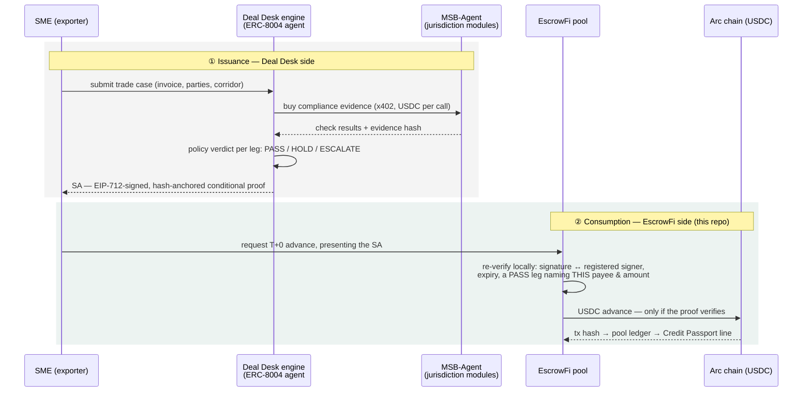
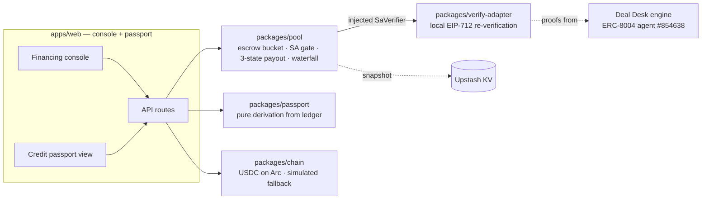

# EscrowFi — architecture & design notes

The long-form companion to the [README](../README.md): how the proof travels
from Deal Desk to the pool, what each package owns, and the invariants the
formal model pins down.

## Deal Desk → EscrowFi: how the SA travels

Two independent systems that share **no trust — only a proof**. Deal Desk
issues the Settlement Authorization; EscrowFi never takes its word for it and
re-verifies everything locally before a cent moves.

The boundary is the point: a HOLD/ESCALATE leg, a tampered byte, an expired or
mis-addressed SA all die at EscrowFi's local check — the issuer being offline
or compromised cannot make the pool pay.

## What "verified locally" checks

Five checks, in this order, before a cent leaves the pool
(`packages/verify-adapter/src/index.ts`):

| # | Check | Failure reason |
|---|---|---|
| ① | Hash integrity — the key must equal the SA's recomputed content hash | `sa_hash_mismatch` |
| ② | EIP-712 signature ↔ a **registered** signer | `signer_not_registered` · `signature_invalid` |
| ③ | Not expired (`bound_to.expires_at`) | `sa_expired` |
| ④ | A **PASS** leg naming *this* payee | `no_pass_leg_for_payee` |
| ⑤ | Requested amount ≤ that leg's `amount_nominal` | `amount_exceeds_leg` |

The registered-signer set is not a config constant: it is resolved on-chain
from `ownerOf(854638)` on the ERC-8004 Identity Registry
[`0x8004A818…BD9e`](https://testnet.arcscan.app/address/0x8004A818BFB912233c491871b3d84c89A494BD9e).
Registry → operator key → SA signature → advance: the whole trust chain
terminates on-chain, and re-pointing the agent's owner re-points the gate.

## Packages

| Package | What it is |
|---|---|
| **`packages/pool`** | The accounting core, and the only place money logic lives. Formally modeled in Quint (`packages/pool/specs/`): 7 fund-safety invariants hold across sampled model checking, and a seeded fuzz harness asserts the same invariants in vitest after every random operation. The model is ground truth; the implementation mirrors it invariant-for-invariant. |
| **`packages/verify-adapter`** | The trust boundary. Runs Deal Desk's own verifier checks locally (vendored): your own money, your own verification — no reliance on the issuer's uptime or honesty. |
| **`packages/chain`** | `CHAIN_MODE=arc` for real Arc-testnet USDC (fail-closed: reverted transfers throw, unknown modes throw, txs bound to chain id) or `simulated` (deterministic hashes, labeled in the UI). |
| **`packages/passport`** | Zero state. A passport recomputed from verifiable records on every read cannot be forged or drift out of sync. |

The structural decision that makes the gate testable: `SaVerifier` is a
dependency-injected async port sitting directly on the money path in
`Pool.requestAdvance`. The pool package has no network dependency at all, so
"advance without a verified SA" is not a bug you can regress into — it is a
test that fails.

## Fund-safety invariants

Each one is enforced in code, covered by tests, and model-checked in Quint
(see [`packages/pool/specs/README.md`](../packages/pool/specs/README.md)).

1. No advance ever leaves the pool without a locally verified SA **bound to
   that payee and amount**; escrowed advances additionally require full escrow
   coverage (`P + fee ≤ F`) and one active advance per invoice.
2. Advances are idempotent by `advanceId`; tampered replays are hard-rejected
   (`DUPLICATE_MISMATCH`) — never a second payment.
3. Fees are fixed at advance time and never round to zero.
4. Escrow funds are strictly isolated from LP liquidity — they can only leave
   through the release waterfall, exactly once per invoice.
5. Money leaves accounting only with an on-chain confirmation
   (`PENDING_PAYOUT → confirm/cancel`); a cancelled payout rolls back fully.
6. Repayment is exact-amount-or-error; the waterfall three-way split always
   sums to the escrow amount.
7. All amounts are bigint USDC minor units. No floats on the money path.

## Why this is different

Huma/Arf-style PayFi advances against receivables, but their underwriting is
institutional due diligence. Here the underwriting artifact is
**machine-verifiable per transaction**: registry → SA signature → escrow
coverage → advance. The failed trade-finance consortia (TradeLens, we.trade,
Marco Polo) required the whole supply chain to change workflows; this design
only has to convince one party — the liquidity provider — and the proof does
that job.

## Circle products

| Product | Use here |
|---|---|
| **USDC (Arc)** | Escrow, advances, waterfall settlement — every money movement |
| **Circle Wallets** | Roadmap: embedded wallets so non-crypto SMEs hold their own keys |
| **CCTP + Bridge Kit** | Roadmap: exporter chooses the receiving chain for advances |
| **Gateway** | Roadmap: treasury routing for multi-pool operations |
| **USYC** | Roadmap: yield on idle pool liquidity between advances |

**Product feedback.** *USDC/Arc*: the EVM-standard surface made the chain
adapter trivially thin (viem + `erc20Abi`); public testnet RPC rate limits were
the only friction — a documented, keyed dev endpoint would remove it.
*Wallets/CCTP*: architecture-level in this release; the docs are clear, but a
single "testnet quickstart matrix" (which chains, which faucets, which quotas)
would make evaluation much faster.

## Honest limitations

- **Custody**: pool funds sit in a developer-controlled wallet for the MVP; the
  production path is an ERC-4626 vault.
- **SA issuance is not yet live-wired.** Demo SAs are minted at boot through
  Deal Desk's own signing code path (vendored, real EIP-712 signatures against
  the real operator key — including a deliberately rogue-signed one). Calling
  the live Deal Desk issuance API is the next integration step; the
  *consumption* side is complete and is what this repo is about.
- **Verifier depth**: module-attestation and rubric-coverage checks (beyond
  hash/signature/expiry/leg-binding) activate once the Deal Desk manifest
  assets ship with the app. Missing checks fail closed, never open.
- **Dispute window**: releases are importer-confirmed or maturity-triggered; a
  dispute/arbitration path (reusing Deal Desk's ESCALATE semantics) is
  designed, not built.
- **Escrow refund** for a deal cancelled before any advance — surfaced by the
  Quint model as a gap; roadmap.
